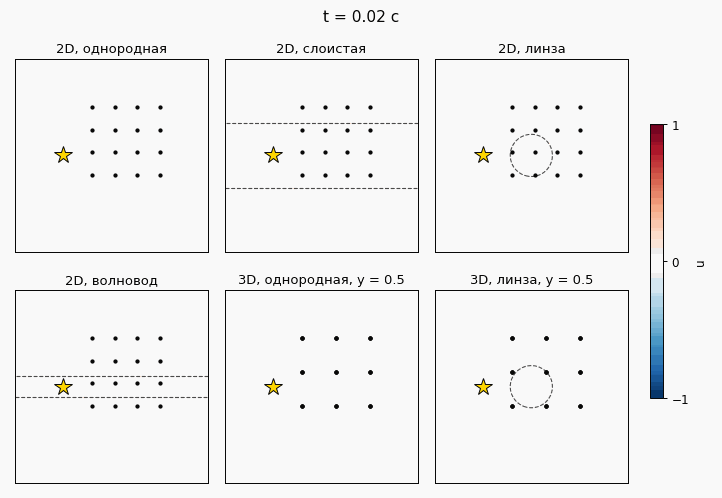

# Волна



## Ноутбуки

- `01_synthetic`: волна, датчики и фазовое пространство.
- `02_models`: прогноз записей датчиков.
- `03_the_well`: акустика по данным [The Well](https://polymathic-ai.org/the_well/).
- `04_tides`: прилив в реке Делавэр по данным [NOAA](https://tidesandcurrents.noaa.gov/).

## Запуск

Python 3.9:

```
pip install numpy scipy matplotlib plotly torch h5py huggingface_hub pillow ipykernel
python waves/real/fetch_tides.py
```
